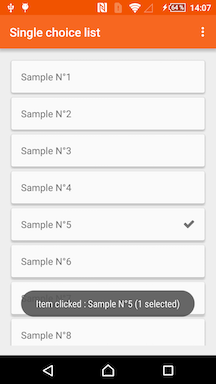
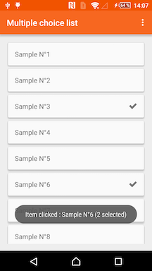
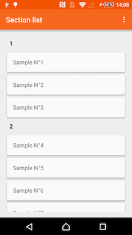
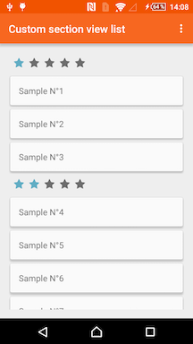
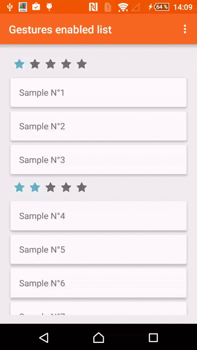
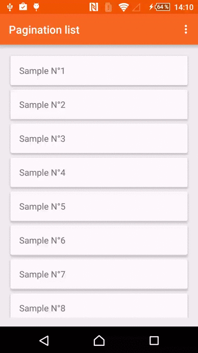

# RecyclerFragment
The recently introduced `RecyclerView` has changed the way of handling list of elements.

This library intends to leverage many of the powerful features that the `RecyclerView` provides by wrapping the `RecyclerView` into a `Fragment` with some predefined `Adapter` classes.

## Previews






## Download
RecyclerFragment requires at minimum Android 2.1 (API 7).

Gradle:

``
compile 'biz.kasual:recyclerfragment:1.0.0'
``

Maven:

```
<dependency>
  <groupId>biz.kasual</groupId>
  <artifactId>recyclerfragment</artifactId>
  <version>1.0.0</version>
  <type>aar</type>
</dependency>
```

Eclipse: [recyclerfragment-1.0.0.aar](https://github.com/KasualBusiness/RecyclerFragment/releases/download/1.0.0/recyclerfragment-1.0.0.aar)

## Basic usage

Create a layout for your fragment that will hold the `RecyclerView`

recycler_layout.xml:

```
<?xml version="1.0" encoding="utf-8"?>
<FrameLayout xmlns:android="http://schemas.android.com/apk/res/android"
              android:layout_width="match_parent"
              android:layout_height="match_parent">

    <android.support.v7.widget.RecyclerView
        android:id="@+id/recycler_view"
        android:layout_width="match_parent"
        android:layout_height="match_parent"
        android:scrollbars="vertical"/>

</FrameLayout>
```

Then create a `Fragment` that inherits from `RecyclerFragment<T>` where `T` is your model that will be used to data bind your views. You don't need to worry about implementing the `sortSectionMethod()` method for now as we will see this while displaying items inside sections.

```
public class YourRecyclerFragment extends RecyclerFragment<T> {

    @Nullable
    @Override
    public View onCreateView(LayoutInflater inflater, ViewGroup container, Bundle savedInstanceState) {
        View contentView = inflater.inflate(R.layout.recycler_layout, container, false);
        return contentView;
    }

    @Override
    public String sortSectionMethod() {
        return null;
    }
}
```

Now create your `View` that will be handled by your `Adapter`. We provide a `DefaultCardView` class that serves as a pre-configured `CardView` and let you freely configure your layout without having to redefine the `CardView` as root. Using this is not mandatory and you can use any `ViewGroup` that fits your needs :

your_item_view.xml :

```
<?xml version="1.0" encoding="utf-8"?>
<merge xmlns:android="http://schemas.android.com/apk/res/android"> // In this case refer to DefaultCardView

    <RelativeLayout
        android:layout_width="match_parent"
        android:layout_height="wrap_content">

        // Your inner views

    </RelativeLayout>

</merge>
```

```
public class YourItemView extends DefaultCardView {

    public YourItemView(Context context, AttributeSet attributeSet) {
        super(context, attributeSet);
        initViews(context);
    }

    public YourItemView(Context context) {
        super(context);
        initViews(context);
    }

    public void bind(T yourModel) {
        // Update your layout given the T model
    }

    private void initViews(Context context) {
        LayoutInflater inflater = (LayoutInflater) context.getSystemService(Context.LAYOUT_INFLATER_SERVICE);
        View view = inflater.inflate(R.layout.sample_item_view, this);
        
        // Retrieve your inner views references
    }
}
```

After designing your item views you can create your `Adapter` that inherits from `RecyclerAdapter<T>` and implement the abstract methods that will be used to create/bind those item views inside your `RecyclerView`.

```
public class YourAdapter extends RecyclerAdapter<T> {

    public YourAdapter(Context context) {
        super(context);
    }

    @Override
    protected View onCreateItemView(ViewGroup parent, int viewType) {
        return new YourItemView(mContext);
    }

    @Override
    protected void onBindItemView(View v, int position) {
        YourItemView sampleItemView = (YourItemView)v;
        YourItemView.bind(getItemAt(position));
    }

}
```

You don't need to worry about the `ViewHolder` pattern, it is already taken care of inside the library so you just need to focus on your layouts without any performance loss.

Finally, in `YourRecyclerFragment`, call the `configureFragment`method with your `RecyclerView` reference from your layout and your `Adapter`. You will then be able to display your items. Your `Fragment` should look like :

```
public class YourRecyclerFragment extends RecyclerFragment<T> {

    @Nullable
    @Override
    public View onCreateView(LayoutInflater inflater, ViewGroup container, Bundle savedInstanceState) {
        View contentView = inflater.inflate(R.layout.recycler_layout, container, false);

        RecyclerView recyclerView = (RecyclerView)contentView.findViewById(R.id.recycler_view);
        YourAdapter adapter = new YourAdapter(getActivity());

        configureFragment(recyclerView, adapter);
        
        List<T> yourItems = new ArrayList<>();
        
        // Fill in your array
        
        displayItems(yourItems);

        return contentView;
    }

    @Override
    public String sortSectionMethod() {
        return null;
    }
}
```

## Advanced usage

### Choice mode


The choice mode pattern is well-known for all developers that previously used the `ListView`. This pattern has not been implemented for `RecyclerView` as its logic differs from the original `ListView`. This library provides a way to configure your `Adapter` with a choice mode that can be either SINGLE_CHOICE or MULTIPLE_CHOICE. By default it is set to SINGLE_CHOICE. Simply call : 

```
yourAdapter.setChoiceMode(RecyclerAdapter.ChoiceMode.MULTIPLE_CHOICE);
```

You can retrieve your selected items with these following methods:

```
yourAdapter.isItemViewToggled(position);
yourAdapter.getSelectedItemViewCount();
```

If you need to manually select/deselect several items, use these methods:

```
yourAdapter.toggleItemView(position);
yourAdapter.clearSelectedItemViews();
```

### Callbacks

We expose several callbacks that can be used to get extra control over your `RecyclerFragment` and/or your `RecyclerAdapter`.

#### ClickCallback

Intercepting simple click callbacks is now the responsability of your `Adapter`. This is understandable since your `Adapter` is responsible of laying out your views. `RecyclerAdapter` comes with a `ClickCallback` that exposes an `onItemClick()` and `onItemLongClick()` methods that are very often needed while using a `RecyclerView`.

```
yourAdapter.setClickCallback(new ClickCallback() {
    @Override
    public void onItemClick(int position) {
        Sample sample = mSampleAdapter.getItemAt(position);
        Toast.makeText(getActivity(), "Item clicked : " + sample.getName() + " (" + mSampleAdapter.getSelectedItemViewCount() + " selected)", Toast.LENGTH_SHORT).show();
    }
});
```

You may need to listen to other click interactions inside your item views but you can create your own interface from `YourAdapter` that are holding your item views.

#### GestureCallback



You may want to interact with your item views to provide a better user experience. The `RecyclerFragment` provides you a way to enable move and/or swipe gestures by using :

```
yourFragment.setGestureCallback(moveDirections, swipeDirections);
```

The directions can be amongst ItemTouchHelper.UP, ItemTouchHelper.DOWN, ItemTouchHelper.LEFT or ItemTouchHelper.RIGHT for each gestures and can also be combined. If you need for instance only to enable swipe gestures, just set the `moveDirection` flag to 0. This snippet enables only swipe gestures for both LEFT and RIGHT directions :

```
yourFragment.setGestureCallback(0, ItemTouchHelper.LEFT | ItemTouchHelper.RIGHT);
```

Finally, you can optionally implement a `GestureCallback` to listen to gesture completions or to even more configure your gesture behaviors :

```
yourFragment.setGestureCallback(0, ItemTouchHelper.LEFT | ItemTouchHelper.RIGHT, new GestureCallback() {
    @Override
    public boolean onMove(int fromPosition, int toPosition) {
        return false;
    }

    @Override
    public void onSwiped(int position, int direction) {

    }
});
```

#### PaginationCallback



For a better user experience as well as loading purposes, you may decide to paginate your list. We provide a smooth way to let you fetch your next page at the proper moment by computing a smart offset depending of your item count in your list. To enable the pagination just configure your fragment with a `PaginationCallback` and use the `displayItems()`method by passing in the `nextPage` reference :

```
yourFragment.setPaginationCallback(new PaginationCallback() {
    @Override
    public void fetchNextPage(int nextPage) {
      // Fetch your next items (for instance either by calling a web service or from your database)
       displayItems(yourNextItems, nextPage);
    }
});
```

### Sections

#### Default sections


Organizing your lists into sections can be critical for complex data. This gives your users clear information about how the list is being sorted. Unfortunately this does come natural when it comes to the implementation part as it would be for all iOS developers familiar with `UITableView`/`UIcollectionView`.

This library lets you easily create your sections and lets you define the way you want to display them. To enable sections for your `RecyclerView`, just implement the abstract `sortSectionMethod()` method by defining the method from your `T` model that is used to sort your data.

Let's assume you defined a simple model as following :

```
public class YourModel {

    private int rate;
    private String name;

    public int getRate() {
        return rate;
    }

    public void setRate(int rate) {
        this.rate = rate;
    }

    public String getName() {
        return name;
    }

    public void setName(String name) {
        this.name = name;
    }
}
```

Let's say now that we want to sort our model by rate. You must let `YourFragment` sort the data first (sorting is not the responsability of the `Adapter`) and implement the abstract method that will indicate that we want the `Adapter` to sort over the `getRate()` method. We will now have for the `YourFragment` class :

```
public class YourRecyclerFragment extends RecyclerFragment<YourModel> {

    @Nullable
    @Override
    public View onCreateView(LayoutInflater inflater, ViewGroup container, Bundle savedInstanceState) {
        View contentView = inflater.inflate(R.layout.recycler_layout, container, false);

        RecyclerView recyclerView = (RecyclerView)contentView.findViewById(R.id.recycler_view);
        YourAdapter adapter = new YourAdapter(getActivity());

        configureFragment(recyclerView, adapter);
        
        List<YourModel> yourItems = new ArrayList<>();
        
        // Fill in your array
        
        // Sort your items
        Collections.sort(yourItems, new Comparator<YourModel>() {
            @Override
            public int compare(YourModel lhs, YourModel rhs) {
                return lhs.getRate() - rhs.getRate();
            }
        });
        
        displayItems(yourItems);

        return contentView;
    }

    @Override
    public String sortSectionMethod() {
        return "getRate";
    }
}
```

The result will be displayed into a pre-defined layout using a simple `TextView` and display the result of the sorted method output.

#### Custom sections


You may want to get more control over the sections. To do so you will need to create your own `Adapter` that inherits from `RecyclerSectionAdapter`. You can then override either `titleForSection()` method if you only want to customize wich text will be displayed into the default section layout or both `onCreateSectionItemView()` and `onBindSectionItemView()` if you want to use a custom layout.

Note that if you implement all these methods, only `titleForSection()` will be taken into consideration, hence ignoring your custom section views.

The implementation would look like for a custom layout section where `YourSectionItemView` is your custom `ViewGroup` representing your section layout :

```
public class YourSectionViewAdapter extends RecyclerSectionAdapter<YourModel> {

    public YourSectionViewAdapter(Context context) {
        super(context);
    }

    @Override
    public View onCreateSectionItemView(ViewGroup parent, int viewType) {
        return new YourSectionItemView(mContext);
    }

    @Override
    public void onBindSectionItemView(View v, int sectionPosition) {
        YourSectionItemView sectionItemView = (YourSectionItemView)v;
        sectionItemView.bind(getFirstItemInSection(sectionPosition));
    }
}
```

To get the first item inside a section, just call `getFirstItemInSection()` method and pass in the section position.

## Wrapping up

Using sections does not prevent you from using gestures. Please note that we purposefully disabled any swipe/move gestures for section items.

Also note that the move gesture is limited inside a section. You cannot move an item from one section to another section. Trying so will automatically stop the move gesture and let the moved item to the last known position.

Finally you should be aware that pagination callbacks won't be triggered either if you use a sectioned `RecyclerView` or if you define a `LayoutManager` other than a `LinearLayoutManager`. This is not supported by the library.

## License

```
Copyright 2015 Kasual Business.

Licensed under the Apache License, Version 2.0 (the "License");
you may not use this file except in compliance with the License.
You may obtain a copy of the License at

   http://www.apache.org/licenses/LICENSE-2.0

Unless required by applicable law or agreed to in writing, software
distributed under the License is distributed on an "AS IS" BASIS,
WITHOUT WARRANTIES OR CONDITIONS OF ANY KIND, either express or implied.
See the License for the specific language governing permissions and
limitations under the License.
```
